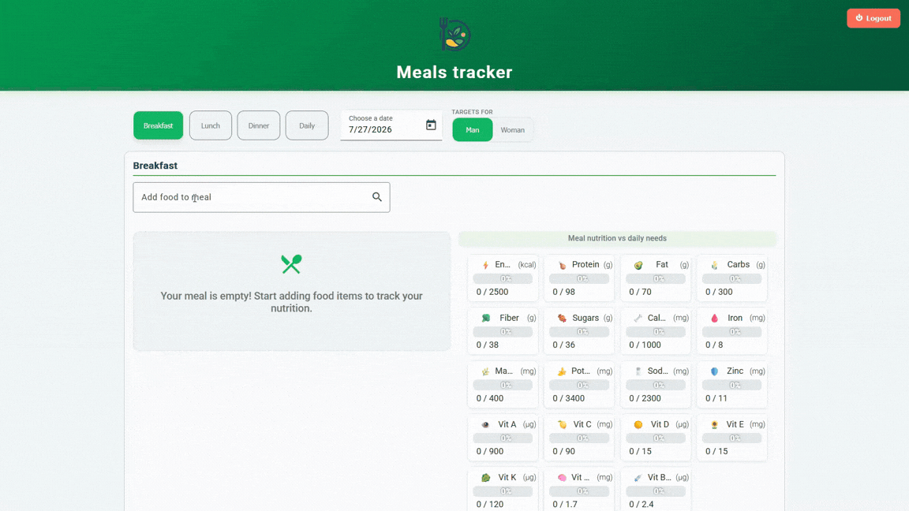

# 🍽️ Meals Tracker

A meal & nutrition tracking app built with **Angular 22**. Search real foods via the **USDA FoodData Central API**, add them to breakfast/lunch/dinner, and see how each meal stacks up against daily nutrient targets — all backed directly by **Firebase**, no custom backend in between.

Built to showcase modern Angular practices: signals end-to-end for state management, Signal Forms, the `resource()` API for async data, and server-side rendering.



**Live demo:** [meals-tracker--meal-nutrition-e08bf.us-east4.hosted.app](https://meals-tracker--meal-nutrition-e08bf.us-east4.hosted.app/)
No account needed — click **View Demo** on the login screen to explore the app pre-filled with sample meals (nothing is saved, nothing touches Firebase).

---

## 🚀 Features

- 🔎 **Food search** with live results from the USDA FoodData Central API, built with Angular Signal Forms and debounced input.
- 📊 **Nutrient tracking** — every meal is compared against daily requirement targets (macros and micros), split by breakfast/lunch/dinner.
- 👀 **Guest/demo mode** — a one-click "View Demo" flow that shows the full app with mock data, no sign-up required.
- ☁️ **Direct Firebase integration** — the Angular app reads/writes Realtime Database and handles auth itself, with no separate API server.
- ✅ **Server-side rendering** via a small Express layer, which also proxies and caches USDA API requests.
- 🎨 Responsive UI built with Angular Material.

---

## 🛠️ Tech Stack

- **Frontend:** Angular 22 (Signals, Signal Forms, `resource()`), Angular Material
- **Data:** [USDA FoodData Central API](https://fdc.nal.usda.gov/)
- **Backend:** Firebase (Realtime Database, Authentication) — accessed directly from the client, no custom API
- **SSR:** Angular Universal / `@angular/ssr` with an Express server that also proxies USDA requests
- **Tooling:** TypeScript, ESLint, Prettier

---

## 🏗️ Architecture

There's no separate backend service. The Angular app talks to Firebase directly for auth and data, and to its own SSR Express server (`src/server.ts`) for USDA API calls — which also caches food-detail lookups in memory to avoid repeat requests.

```
Browser  ──►  Angular app  ──►  Firebase (Auth + Realtime Database)
                   │
                   └────────►  Express SSR server  ──►  USDA FoodData Central API
```

---

## ▶️ Getting Started

### Prerequisites
- Node.js
- A [USDA FoodData Central API key](https://fdc.nal.usda.gov/api-key-signup) (free)

### Setup
```bash
npm install
```

Create a `.env` file in the project root:
```
USDA_API_KEY=your_usda_api_key
```

### Run locally (dev server, hot reload)
```bash
npm start
```

### Run in production mode (SSR)
```bash
npm run start-prod
```

### Other scripts
```bash
npm run build       # production build
npm test            # unit tests
npm run lint        # lint check
```

---

## 👨‍💻 Author

Built by **Willy Pezant**

- 💼 [LinkedIn](https://www.linkedin.com/in/willypezant/)
- 🐙 [GitHub](https://github.com/will-pznt)
